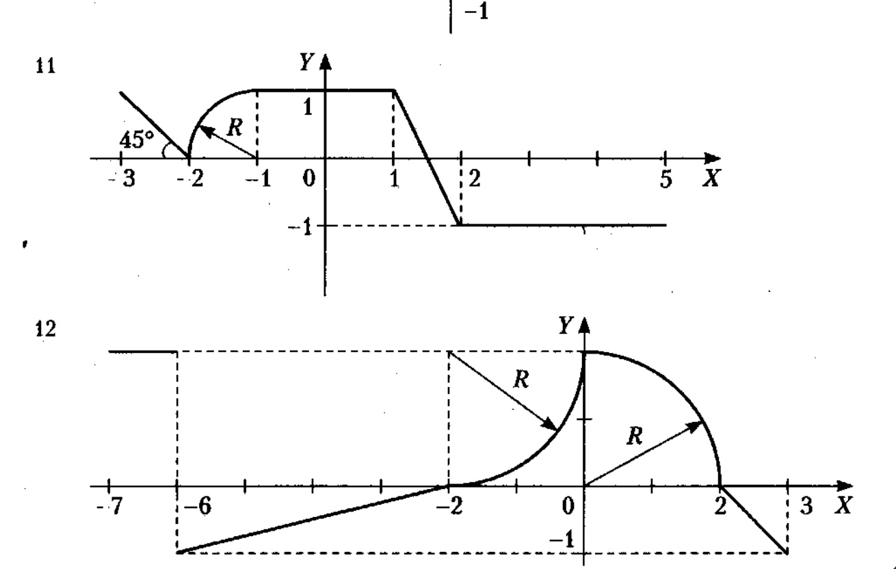

# go-lab2

<h2>Task 1. Calculate the value of a function</h2>
Write a program that calculates the value of the function. The function given in the form of a graph.
Also need to create tests for function.
In lab2_1.go, lab2_1_test.go variant 12 as example

<h2>Task 2. Hitting a point In the shaded area</h2>
Write a program that determines whether the point with the given coordinates are in the black area.
Also need to create tests.
In lab2_2.go, lab2_2_test.go variant 1 as example.

